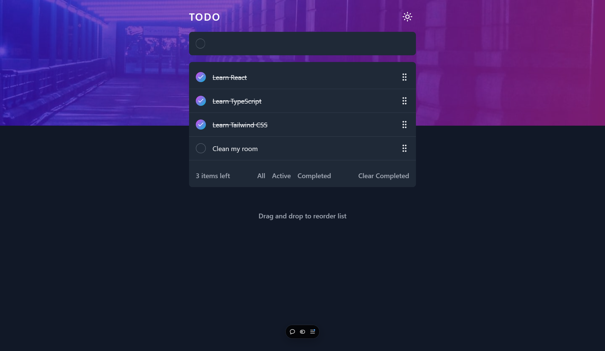

# To-Do App

This is a simple To-Do application built with React, Tailwind CSS, and TypeScript. The application allows you to add tasks, filter them based on their completion status, reorder tasks via drag and drop, and switch between light and dark themes.

## Demo

- [View Live Demo](https://cda-react-todo-app.vercel.app/)

## Features

-   Add new tasks
-   Filter tasks by completion status
-   Drag and drop tasks to reorder them
-   Toggle between light and dark themes

## Screenshots

## Usage

1. Add new tasks by typing into the input field and pressing Enter.
2. Filter tasks by clicking on the filter buttons to show all tasks, only completed tasks, or only incomplete tasks.
3. Reorder tasks by dragging and dropping them into the desired order.
4. Toggle between light and dark themes using the theme switcher button.

## Technologies Used

-   [React](https://reactjs.org/)
-   [Tailwind CSS](https://tailwindcss.com/)
-   [TypeScript](https://www.typescriptlang.org/)
